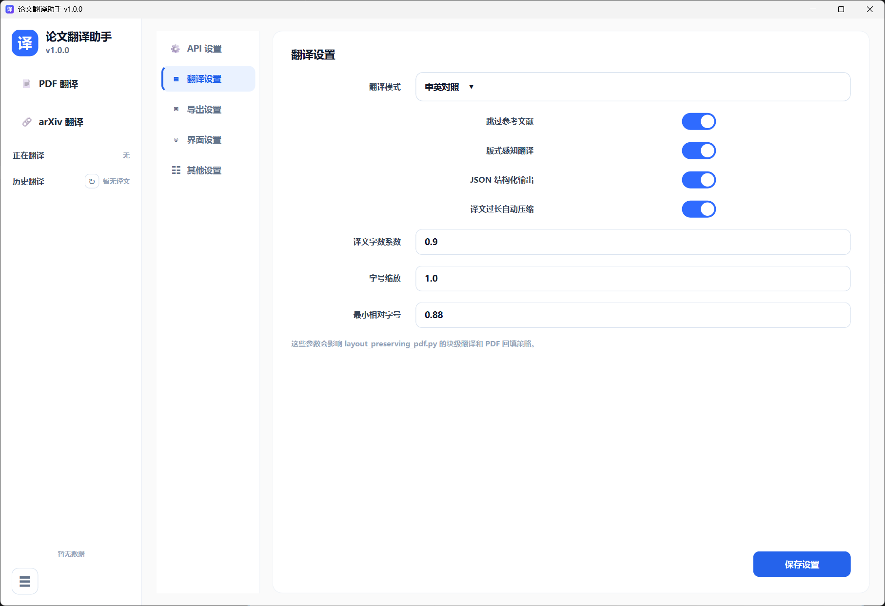
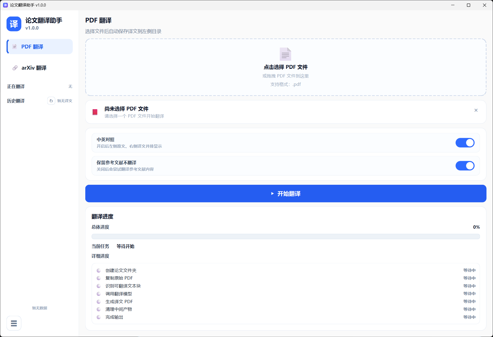
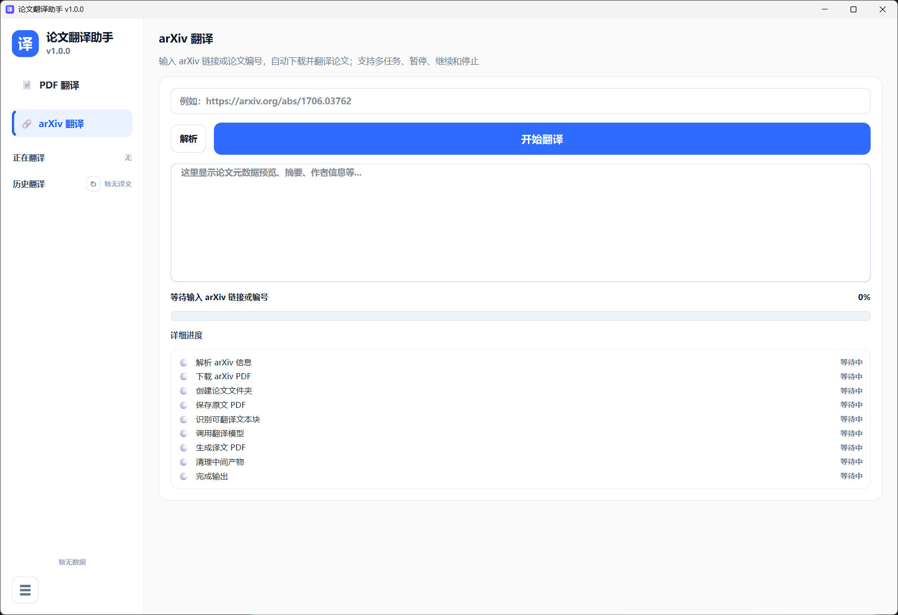

<div align="center">

# 论文翻译助手

**面向科研阅读场景的 PDF / arXiv 智能翻译桌面工具**

支持本地 PDF 翻译、arXiv 论文翻译、原文译文对照阅读、多任务翻译、暂停继续、术语表管理和自定义模型 API 配置。

<br>



<br><br>

<a href="https://github.com/你的用户名/你的仓库名/releases/latest">
  
</a>


</div>

---

## 功能特点

| 功能       | 说明                                 |
| -------- | ---------------------------------- |
| PDF 翻译   | 支持本地 PDF 文件翻译，并生成译文 PDF            |
| arXiv 翻译 | 支持输入 arXiv 链接或论文编号后自动下载并翻译         |
| 原译文对照    | 支持原文 PDF 与译文 PDF 左右并排阅读            |
| 多任务翻译    | 支持多个 PDF / arXiv 任务同时运行            |
| 暂停与继续    | 翻译过程中可以暂停任务，之后继续执行                 |
| 停止任务     | 可以终止正在运行的任务                        |
| 术语表      | 支持维护专业术语，提高翻译一致性                   |
| 自定义 API  | 支持配置 API Key、模型名称、API Base URL 等参数 |
| 输出目录     | 支持设置译文保存目录                         |

---

## 界面预览

### PDF 翻译



### arXiv 翻译



### 设置界面


---

## 下载方式

请进入 Releases 页面下载最新版：

[点击下载最新版](https://github.com/你的用户名/你的仓库名/releases/latest)

下载后解压，双击运行：

```text
论文翻译助手.exe
```

---

## 使用说明

### 1. 配置 API

首次使用前，进入：

```text
设置 → API 设置
```

填写：

```text
API Base URL
API Key
模型名称
请求超时时间
最大重试次数
最大输出 Tokens
Temperature
请求间隔
```

然后点击“保存设置”。

### 2. 翻译 PDF

点击左侧：

```text
PDF 翻译
```

选择本地 PDF 文件后点击“开始翻译”。

### 3. 翻译 arXiv

点击左侧：

```text
arXiv 翻译
```

输入 arXiv 链接或论文编号，例如：

```text
https://arxiv.org/abs/1706.03762
```

然后解析并开始翻译。

### 4. 输出位置

默认输出到：

```text
C:\Users\当前用户\translate
```

每篇论文会生成独立文件夹，通常包含：

```text
原文.pdf
译文.pdf
```

---

## 注意事项

* 使用前需要配置可用的大模型 API。
* 请勿泄露自己的 API Key。
* 翻译速度取决于论文长度、网络情况和模型 API 响应速度。
* 若任务正在等待 API 返回，暂停或停止可能会在当前请求完成后生效。

---

<div align="center">

如果这个工具对你有帮助，欢迎下载使用。

</div>
# Translate
